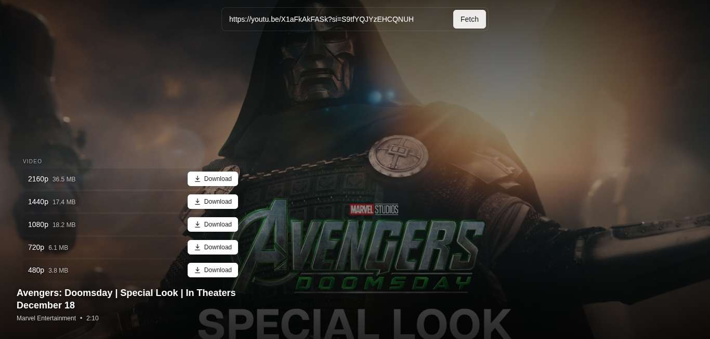

# Capio

A local YouTube downloader with a FastAPI + yt-dlp backend and a React frontend. Paste a YouTube URL, pick a resolution, download the video or audio — all running on your own machine.



<!-- Replace screenshot.png with an actual screenshot of the app, placed at the project root -->

## Project structure

```
capio/
├── server/          # FastAPI backend (Python)
│   ├── main.py
│   ├── requirements.txt
│   └── cookies.txt  # you create this — see step 4 below
├── client/          # React frontend (TypeScript)
└── Makefile         # `make dev` starts both
```

## Prerequisites

Install these before cloning:

| Tool                      | Why                                                                                           | Check if installed  |
| ------------------------- | --------------------------------------------------------------------------------------------- | ------------------- |
| Python 3.10+              | Runs the backend                                                                              | `python3 --version` |
| Node.js + npm             | Runs the frontend                                                                             | `node --version`    |
| `make`                    | Starts both servers with one command                                                          | `make --version`    |
| [Deno](https://deno.land) | yt-dlp needs a JS runtime to solve YouTube's signature challenge — without it, downloads fail | `deno --version`    |

If Deno isn't installed:

```bash
curl -fsSL https://deno.land/install.sh | sh
```

Then follow the on-screen instructions to add it to your PATH, restart your terminal, and confirm with `deno --version`.

## Setup (first time only)

**1. Clone the repo:**

```bash
git clone <repo-url>
cd capio
```

**2. Set up the backend:**

```bash
cd server
python -m venv venv
source venv/bin/activate
pip install -r requirements.txt
cd ..
```

**3. Set up the frontend:**

```bash
cd client
npm install
cd ..
```

**4. Get a `cookies.txt` file.** YouTube blocks most requests without a logged-in session. Export your cookies using a browser extension like [Get cookies.txt LOCALLY](https://chromewebstore.google.com/detail/get-cookiestxt-locally/cclelndahbckbenkjhflpdbgdldlbecc) while logged into YouTube, then save the exported file as:

```
server/cookies.txt
```

**Note:** this file expires periodically (YouTube rotates session cookies) — if downloads start failing with an auth/bot-check error, just re-export and replace this file.

## Running the app

From the project root:

```bash
make dev
```

This starts the backend and frontend together. Open the URL the frontend prints in your terminal (usually `http://localhost:5173`) in your browser.

To stop, press `Ctrl+C` in the terminal running `make dev`.

## How it works

- **`POST /video-info`** — takes a YouTube URL, returns available resolutions, filesize estimates, and metadata (title, thumbnail, duration).
- **`POST /download`** — takes a URL, a `format_id`, and a `kind` (`video` or `audio`), downloads it through yt-dlp, and streams the resulting file back to the browser.
- All backend logic lives in `server/main.py` — it's a single-file FastAPI app on purpose, easy to read top to bottom.

## Modifying the app

A few common changes and where to make them, all in `server/main.py`:

- **Change which video formats are offered** — edit the filtering logic inside `get_video_info()`, in the loop over `info.get("formats", [])`. Currently it only keeps `.mp4` formats with a video track; loosen or tighten those conditions to include/exclude formats.
- **Add a new error type to handle gracefully** — add a new `re.search(...)` check inside `classify_ytdlp_error()`. Each one maps a recognizable yt-dlp error string to a clean HTTP status + message instead of a generic failure.
- **Change the default port** — the app reads `PORT` from the environment (`os.environ.get("PORT", 8000)`), so you can override it without touching code: `PORT=9000 python main.py`.
- **CORS is currently wide open** (`allow_origins=["*"]`) since this only runs locally. If you ever expose this beyond your own machine, lock this down in the `CORSMiddleware` block near the top of the file.
- **Frontend UI/styling** lives entirely in `client/` — a standard React + TypeScript app, no backend changes needed for pure UI tweaks.

## Troubleshooting

| Symptom                                      | Likely cause                                                                                                         |
| -------------------------------------------- | -------------------------------------------------------------------------------------------------------------------- |
| `auth_expired` / "sign in to confirm" errors | `cookies.txt` is stale — re-export it (step 4)                                                                       |
| `forbidden: YouTube returned 403`            | Usually also stale cookies, or you've been rate-limited — wait a bit and retry                                       |
| Downloads only offer low resolutions         | YouTube restricts some formats without a PO token — a known current yt-dlp/YouTube limitation, not a bug in this app |
| `extractor_broken` errors                    | yt-dlp is out of date — run `pip install -U yt-dlp` inside `server/venv`                                             |
